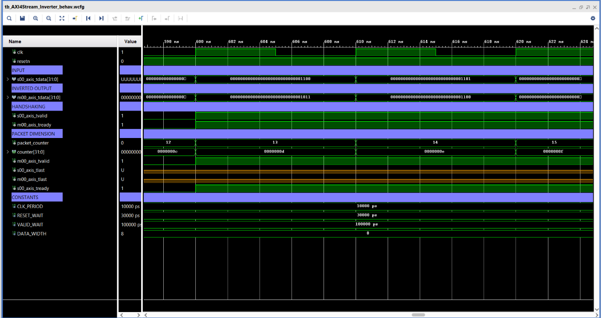

# AXI4Stream Inverter
This is a Vivado 2019.1 Project, used to invert the incoming BMP image.
This module is contained in a larger project, which aims to make a transfer of data among the DDR present on the Zynq and the PL. In particular the block scheme we are referring to is the following:

The Vivado block design in which is contained the *AXI4Stream_Inverter* is the following:

Now let's focus on the Inverter. First of all we have to remember and analyze how a BMP image is structured:

There are 54 Bytes of Header, and this is important because we don't have to invert those Bytes.
In the design of this module the Bytes from 0x02 to 0x05 has been exploited to extrapolate the dimension of the incoming file.

In the previous figure, we understand how the header has been used to extract the file dimension, but being written in Little Endian format, we have to invert it in order to get the real dimension value.

The incoming data, being an image, can have values ranging just from 0 to 255, so the *DATA_WIDTH* is set to 8, indeed *2^8 = 256*.
The basic idea behind this module is counting the number of incoming packets, extracting the image dimension from the packets 3,4,5,6, inverting the data from the packet 55 on, and then resetting the packet counter to 0 once the image has been completely inverted. The way this operation is done, will be described in more detail later on in the documentation.

Furthermore this module gives the opportunity to exploit 2 debugging ports *counter* and *file_dimension* that will be available as soon as the generic *DEBUG_MODE* is set to *TRUE*. *counter* keeps tracks of the internal packet counter, while *file_dimension* tells us the dimension of the incoming data extrapolated by the module.

# IP-Core

Wrapping of *Inverter* for AXI4-Stream interface for IP-Core and usage with AXI DMA.

## Generic

  - **DEBUG_MODE**:  If DEBUG_MODE = TRUE, the module shows the ports *counter* and *file_dimension* in such a way we can use them for debugging with ILA, *BOOL* type, default **TRUE**.

  - **DATA_WIDTH**: The incoming image can have values that range from 0 to 255 by definition, so the data can be represented by just 8 bits, *POSITIVE* type, default **8**.

## Port

  - **resetn**:	Synchronous resetn active low.

  - **clk**: PS Clock.

  - **s00_axis**: AXI4 Stream Slave interface, data coming from AXI DMA.
      - **s00_axis_tdata**: Incoming data from the DMA/Chip2Chip, *STD_LOGIC_VECTOR((((DATA_WIDTH -1)/32+1)*32)-1 downto 0)* type.
      - **s00_axis_tvalid**: Valid of the incoming data, *STD_LOGIC* type.
      - **s00_axis_tlast**: End of the incoming packets, *STD_LOGIC* type.	  
      - **s00_axis_tready**: Ready of the inverter, coming from the "following" DMA, *STD_LOGIC* type.

  - **m00_axis**: AXI4 Stream Master interface, inverted image sent to the DDR.
      - **m00_axis_tdata**: Inverted output to be sent to the DDR via DMA/Chip2Chip, *STD_LOGIC_VECTOR((((DATA_WIDTH -1)/32+1)*32)-1 downto 0)* type.
      - **m00_axis_tvalid**: Output valid, *STD_LOGIC* type.
      - **m00_axis_tlast**: End of the exiting packets, *STD_LOGIC* type.	  
      - **m00_axis_tready**: Ready of the following DMA/Chip2Chip, *STD_LOGIC* type.	  

	  	 

# Sources
We can find in *hdl/* the following module directory:

  - **AXI4Stream_Inverter**: Wrapper used for renaming the input and output interfaces with AXI4-Stream for IP-Core.
  - **Inverter**: It is the module that performs the inversion of the incoming data.

# Simulation
We can find in *src/* the following module directory:

  - **tb_AXI4Stream_Inverter**: HDL simulation of *AXI4Stream_Inverter*.
  - **tb_AXI4Stream_Inverter_behav**: Waveform of *tb_AXI4Stream_Inverter*.

